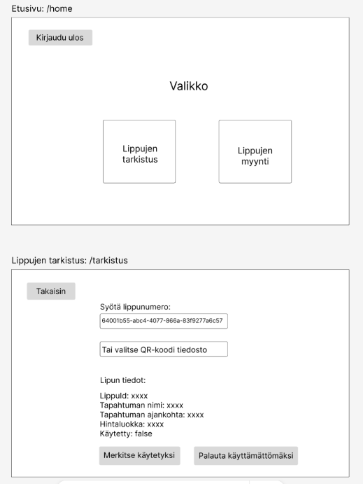
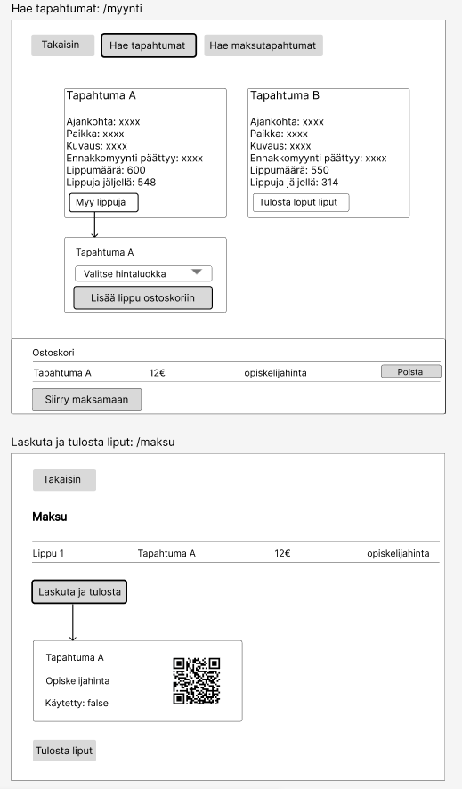

# TicketGuru Client dokumentaatio

Tässä repositoriossa on Ohjelmistoprojekti 1 -kurssilla toteutetun lipunmyyntijärjestelmän käyttöliittymän lähdekoodi. Palvelinpuolen (back end) lähdekoodi nähtävissä repositoriossa [ohjelmistoprojekti1](https://github.com/devjuhis/ohjelmistoprojekti1).

### Tiimi: 
Hiltunen Ilona, Järvinen Juho, Keinänen Aleksi, Klenberg Eriika, Nevala Sanni

## Käytetyt teknologiat
Projekti yhdistää moderneja frontend-teknologioita, joista tässä keskeisimmät.

* **React** JavaScript-kirjasto käyttäjäystävällisten käyttöliittymien rakentamiseen komponenttipohjaisella arkkitehtuurilla.
* **Vite:** Kehitys- ja rakennusprosessi React-projektille.
* **React Router DOM:** Reitityskirjasto, jonka avulla käyttöliittymäsovelluksessa voidaan hallita  reititystä ja monisivuisten näkymien navigaatiota.
* **Material-UI (MUI):** Käyttöliittymäkirjasto, jossa on tyylikkäitä ja käyttövalmiita komponentteja, esim. painikkeita ja lomakkeita.
* **JSQR ja qrcode.react:** QR-koodien luontiin ja skannaamiseen liittyvät kirjastot.

## Käyttöliittymän keskeiset toiminnot
Tässä esitellään käyttöliittymän keskeiset toiminnot rautalankamalleina ja eri käyttäjäroolien näkökulmasta.

### User-rooli
Sisäänkirjautuneelle User-roolin käyttäjälle näkyy navigaatio lippujen tarkistukseen sekä lippujen myyntiin.

#### Lippujen tarkistus
Lippujen tarkistusta käytetään asiakkaan saapuessa tapahtumaan. Toiminto tarkistaa, että haetun lipun Käytetty-tila on false. Jos käytetty tila on false, sen voi muuttaa käytetyksi true. Virheiden varalta on myös mahdollisuus toiminnon peruuttamiseksi, muuttamalla tila takaisin false:ksi.

#### Lippujen myynti
Lippujen myynnissä haetaan tapahtumat ja valitaan mihin myydään lippuja sekä lipun hintaluokka. Ostoskorista siirrytään maksamaan ja tulostamaan lippuja. Maksun jälkeen generoituu tulostettavat liput, joissa on yksilölliset QR-koodit. Myynti-osiossa pystyy tarkastelemaan myös aiempia lipunmyyntitapahtumia.

### Admin-rooli
Sisäänkirjautuneelle Admin-roolin käyttäjälle näkyy tarkistuksen ja myynnin lisäksi myös navigaatio hallinta-sivulle. Tarkistus- ja myyntisivut ovat toiminnoiltaan vastaavat kuin yllä esitellyt User-roolin sivut.

#### Tapahtumien ja käyttäjien hallinta

